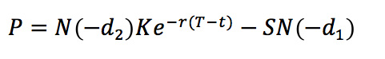
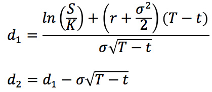

<div align="center">
  <h1>Black-Scholes Option Price Calculator</h1>
</div>


### 📌 Badges
<!-- Add your badges here -->
<!-- Add your badges here -->
<p align="center">
  
  
  
  
  
  
</p>


### 🔄 Sequence Diagram
This diagram illustrates the flow of data from the user to the application and the Black-Scholes calculation module.

```mermaid
sequenceDiagram
    participant U as User
    participant A as Streamlit App
    participant B as Black-Scholes Module

    U->>A: Input parameters (S, K, r, T, σ)
    A->>B: Request calculation with parameters
    B-->>A: Return option price and Greeks
    A->>U: Display results and charts
```



---

### 📖 Overview
This project provides an interactive tool for options traders and finance students to understand the dynamics of option pricing. Users can input various parameters and see in real-time how they affect the option's price and its risk metrics (the Greeks). The application also visualizes these relationships through plots.

The calculations are based on the foundational **Black-Scholes model**, a mathematical model for the dynamics of a financial market containing derivative investment instruments.

---

### 📈 The Black-Scholes Model
The model provides a theoretical estimate of the price of European-style options.

#### Core Formulas
The price of an option is determined by several variables. The model first calculates two intermediate values, $d_1$ and $d_2$.

$$d_1 = \frac{\ln(\frac{S}{K}) + (r + \frac{\sigma^2}{2})(T-t)}{\sigma\sqrt{T-t}}$$

$$d_2 = d_1 - \sigma\sqrt{T-t}$$


Where:
- $S$ = Current price of the underlying asset
- $K$ = Strike price of the option
- $r$ = Risk-free interest rate
- $T-t$ = Time to maturity of the option (in years)
- $\sigma$ = Volatility of the underlying asset's returns
- $N(.)$ = The cumulative distribution function (CDF) of the standard normal distribution

---

#### Call and Put Option Prices

Using $d_1$ and $d_2$, the price for a **call option (C)** and a **put option (P)** can be calculated.

**Call Option Price:**
$$C = SN(d_1) - N(d_2)Ke^{-r(T-t)}$$


**Put Option Price:**
$$P = N(-d_2)Ke^{-r(T-t)} - SN(-d_1)$$


<br>

#### The Option Greeks

The "Greeks" are risk measures that represent the sensitivity of an option's price to a change in its underlying parameters.

| Greek | Formula (Partial Derivative) | Call Formula | Put Formula |
| :--- | :---: | :--- | :--- |
| **Delta** | $\frac{\partial V}{\partial S}$ | $N(d_1)$ | $-N(-d_1) = N(d_1) - 1$ |
| **Gamma** | $\frac{\partial^2 V}{\partial S^2}$ | $\frac{N'(d_1)}{S\sigma\sqrt{T-t}}$ | $\frac{N'(d_1)}{S\sigma\sqrt{T-t}}$ |
| **Vega** | $\frac{\partial V}{\partial \sigma}$ | $SN'(d_1)\sqrt{T-t}$ | $SN'(d_1)\sqrt{T-t}$ |
| **Theta** | $\frac{\partial V}{\partial t}$ | $-\frac{SN'(d_1)\sigma}{2\sqrt{T-t}} - rKe^{-r(T-t)}N(d_2)$ | $-\frac{SN'(d_1)\sigma}{2\sqrt{T-t}} + rKe^{-r(T-t)}N(-d_2)$ |
| **Rho** | $\frac{\partial V}{\partial r}$ | $K(T-t)e^{-r(T-t)}N(d_2)$ | $-K(T-t)e^{-r(T-t)}N(-d_2)$ |

---

### ✨ Features

- **Dynamic Calculation**: Computes prices for both Call and Put options.
- **Greeks Analysis**: Calculates the five primary option Greeks: Delta, Gamma, Vega, Theta, and Rho.
- **Interactive Sidebar**: Allows users to easily modify all Black-Scholes parameters:
    - Underlying Asset Price ($S$)
    - Strike Price ($K$)
    - Risk-Free Rate ($r$)
    - Time to Expiry (in days)
    - Volatility ($\sigma$)
- **Data Visualization**: Generates plots showing how the option price and each Greek change with the underlying asset price.

---

### 🛠️ Technologies Used

- **Python**: Core programming language.
- **Streamlit**: For building the interactive web application.
- **NumPy**: For numerical operations.
- **SciPy**: Used for its statistical functions, specifically the standard normal CDF (`norm.cdf`).
- **Matplotlib & Seaborn**: For creating the data visualizations.

---

### 🚀 How to Run Locally

1.  **Clone the repository:**
    ```sh
    git clone [https://github.com/your-username/Black-Scholes-Calculator.git](https://github.com/your-username/Black-Scholes-Calculator.git)
    cd Black-Scholes-Calculator
    ```
2.  **Install dependencies:**
    (Make sure you have a `requirements.txt` file with the libraries listed above)
    ```sh
    pip install -r requirements.txt
    ```
3.  **Run the Streamlit application:**
    ```sh
    streamlit run BSM_streamlit.py
    ```

---

### 🐍 Code Implementation

Below are snippets from `BSM_streamlit.py` showing the implementation of the core formulas.

#### Black-Scholes Price Function

```python
def blackScholes(S, K, r, T, sigma, type="c"):
    "Calculate Black Scholes option price for a call/put"
    d1 = (np.log(S/K) + (r + sigma**2/2)* T)/(sigma*np.sqrt(T))
    d2 = d1 - sigma * np.sqrt(T)

    try:
        if type == "c":
            price = S * norm.cdf(d1, 0, 1) - K * np.exp(-r * T) * norm.cdf(d2, 0, 1)
        elif type == "p":
            price = K * np.exp(-r * T) * norm.cdf(-d2, 0, 1) - S * norm.cdf(-d1, 0, 1)

        return price
    except:  
        st.sidebar.error("Please confirm all option parameters!")
```

#### Greeks Functions

```python
def optionDelta (S, K, r, T, sigma, type="c"):
    "Calculates option delta"
    d1 = (np.log(S/K) + (r + sigma**2/2)* T)/(sigma*np.sqrt(T))
    try:
        if type == "c":
            delta = norm.cdf(d1, 0, 1)
        elif type == "p":
            delta = -norm.cdf(-d1, 0, 1)
        return delta
    except:
        st.sidebar.error("Please confirm all option parameters!")

def optionGamma (S, K, r, T, sigma):
    "Calculates option gamma"
    d1 = (np.log(S/K) + (r + sigma**2/2)* T)/(sigma*np.sqrt(T))
    try:
        gamma = norm.pdf(d1, 0, 1)/ (S * sigma * np.sqrt(T))
        return gamma
    except:
        st.sidebar.error("Please confirm all option parameters!")
```

---

### ⚠️ Assumptions of the Model

The Black-Scholes model is based on a set of assumptions. It's important to be aware of these as they may not hold true in real-world markets.

- **European Options**: The model applies to options that can only be exercised at the expiration date.
- **No Dividends**: The underlying stock does not pay dividends during the option's life.
- **Constant Volatility and Risk-Free Rate**: The model assumes that the volatility of the underlying asset and the risk-free interest rate are constant and known.
- **Log-normal Distribution**: The returns on the underlying asset are assumed to follow a log-normal distribution.
- **Efficient Markets**: There are no transaction costs, and all available information is reflected in the asset price (no arbitrage opportunities).




The formulas for d1 and d2 are:



